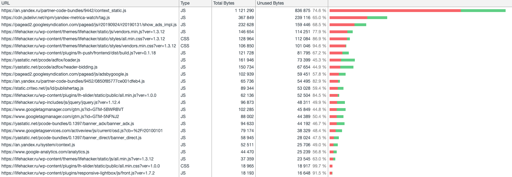

# Домашнее задание «Использование браузерных DevTools - анализ сайта»

## Network

### Дублирование ресурсов:

`node findDuplicateRequests.js`

```
[
  'https://matchid.adfox.yandex.ru/getcookie',
  'https://pagead2.googlesyndication.com/pagead/js/adsbygoogle.js',
  'https://pagead2.googlesyndication.com/pagead/js/r20190924/r20190131/show_ads_impl.js',
  'https://www.googletagservices.com/activeview/js/current/osd.js?cb=%2Fr20100101',
  'https://yastatic.net/pcode/adfox/adfox-adx-stub.html',
  'https://yastatic.net/pcode/adfox/adfox-adx-stub.js',
  'https://adservice.google.ru/adsid/integrator.js?domain=lifehacker.ru'
]
```

### Блокирующий JS:


Можно увидеть, что скрипты подлючаются в теге head без async/defer.


### Блокирующий CSS:


Подключаются в теге `head`.

### Лишний размер ресурса:

Сортируем по size


Результат:

1. Слишком большая картинка `beeline_blog_1567505098.jpg`.
1. Дублирующийся запрос с ресурсом большого размера `show_ads_simple.js`

### Медленно загружающиеся ресурсы

Сортируем по time:


1. `https://fpn.flipboard.com/pix/__fpn.gif?utm_source=https%3A%2F%2Flifehacker.ru%2F`


*Информация о местороложении: [dns](https://www.dnsqueries.com/en/ip_geographical_informations.php)

2. https://lifehacker.ru/wp-includes/js/jquery/jquery.js?ver=1.12.4

Сервер долго формировал ответ


## Performance

Запись профиля начинается с перезагрузки страницы.

### Времена до требуемых событий

До First Paint:


До First Meaningful Paint:


До DOMContentLoaded:


До Load:


### Этапы обработки документа:


## Coverage




Интерактивные элементы (прокликать, чтобы получить реально значение coverage):

* Авторизация


* Поиск

* Закрыть рекламу

* Слайдер


Это понижает процент неиспользованного кода с 59 до 57.

### Объем неиспользуемых данных:

`node calcUnusedCssJs.js`

```
CSS: 803 KB
JS: 2272 KB
```


# Бонус


## Network

### Дублирование ресурсов:

`node findDuplicateRequests.js slow`

```
[
  'https://pagead2.googlesyndication.com/pagead/js/adsbygoogle.js',
  'https://yastatic.net/safeframe-bundles/0.69/1-1-0/render.html'
]
```

### Блокирующий JS и CSS:

Снова синхронные скрипты в head и стили в head.

### Лишний размер ресурса

Картинки не оптимизированы по размеру для мобильных устройств.


## Performance

### Времена до требуемых событий

До First Paint:


До First Meaningful Paint:


До DOMContentLoaded:


До Load:


### Этапы обработки документа:


## Coverage


### Объем неиспользуемых данных:

`node calcUnusedCssJs.js slow`

```
CSS: 786 KB
JS: 2316 KB
```